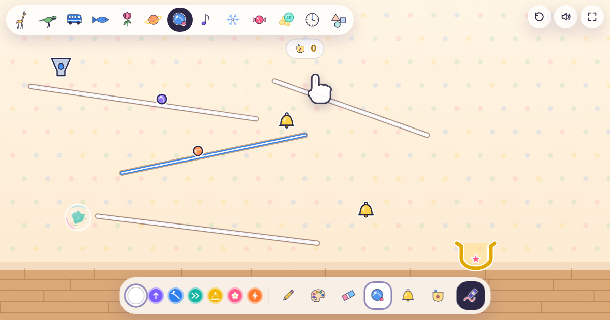

# ゆびさきキャンバス

指で線を描いたり、色を散らしたり、つまんで投げたりすると、画面の中の世界が動き出す子ども向けのタッチキャンバスです。大きなタッチディスプレイで、何人かで一緒に遊べるように作っています。

画面には文字を出していません。ボタンは絵だけ、キャラクターの反応も絵の吹き出しで、表示するのは数字と記号だけです。字が読めない小さな子でも、どの言葉を話す子でも同じように遊べます。

**▶ https://nozomitaguchi.github.io/yubisaki-canvas/**

> 僕自身のアイディアではなく、子どもたちと行ったデジタルアートの展示で子どもが夢中になっていたものを、家でも遊びやすいように置いているものです。キャラクターや見た目は展示とは別に作っています。Claude（Opus 5.5）の性能を試すために作ってもらったもので、最初の版は30分ほどでできました。

## 13の世界

| 世界 | できること |
|---|---|
| どうぶつ | 線の上を動物が歩く。えさやボールを出せる |
| きょうりゅう | たまごから赤ちゃんが生まれる。火山が噴火して岩が転がる |
| のりもの | 線を描くと線路になって電車が走る。車・飛行機・気球 |
| うみ | 魚の群れが線に沿って泳ぐ。泡やえさを出せる |
| おはな | 線がつるになって花が咲く。たね・あめ・かぜ |
| うちゅう | 無重力。惑星が周りの物を引き寄せ、線に沿ってロケットが飛ぶ |
| ころころ | 線でレールを作り、ビー玉をゴールのカップまで転がす。ベルに当たると鳴る |
| おんがく | 線に玉が当たると音が鳴る。線の色で楽器（ピアノ・もっきん・ベルなど）が変わる |
| ゆき | 雪の坂はつるつる。ペンギンがすべり、雪玉は転がすと大きくなる |
| おかし | 線がクリームになり、ありさんがおかしを巣まで運ぶ |
| まるまる | 数を「まる」で見る。10こ集まると「じゅう」に合体。[まるまる電卓](https://maru-maru-calc.github.io/maru-maru-calc/)の考え方をもとにしています |
| とけい | 針を指で回すと空や太陽・月が動き、時刻（9:30 のような表示）と、その時間にすること（ごはん・おふろなど）が絵で出る |
| かたち | ぐるっと囲むと、描いた形がきれいに整って、かどに番号がつき、かどの数が出る |

## 遊び方

世界を開くと、半透明の手が出てきて遊び方をやってみせます（線を描く、つまんで投げる、ボタンを押す など）。画面を触るとすぐに引っ込み、しばらく誰も触らないとまた出てきます。

- **線を描く**：描いた線は地面になり、キャラクターが歩いたり、物が転がったりする
- **線の色で力が変わる**（色のボタンに小さな絵で表示）：しろ＝ふつう、むらさき＝ふわふわ浮く、あお＝すべりだい、みどり＝動く道、きいろ＝トランポリン、ピンク＝花が咲く、オレンジ＝びりびり
- **ぐるっと囲む**：囲んだ中が模様で塗られる
- **けしごむ**：なぞったところの線が切れて消え、絵の具や物も消せる（ボウルや時計など、その世界に欠かせないものは消えない）
- **シャボン玉を割る**：中の絵の具が飛び散る
- **つまんで投げる**：キャラクターや物は、指でつまんで投げられる
- **2人で同時に描く**：みんなが跳ねてお祝いする
- **おえかき**：自分で描いた絵や、紙に描いた絵の写真を取り込むと、その絵が世界の中で動き出す

描いたものは20秒ほどで自然に消えていきます。最初から置いてある線や動物も、しばらくすると消えて画面が広くなります（ボウル・時計・巣など、その世界に欠かせないものだけは残ります）。右上のボタンでいつでも最初の状態に戻せます。

## ぜんがめんで遊ぶ

右上の四角いボタンで、ブラウザのアドレスバーやボタンを隠した全画面になります（Android の Chrome、パソコン、iPad）。

iPhone はブラウザの全画面に対応していないので、ボタンを押すと「共有 → ホーム画面に追加」の絵が出ます。ホーム画面に追加したアイコンから開くと、ブラウザの枠なしで遊べます（Android でも「ホーム画面に追加」すると同じように全画面で開きます）。

## つくり

`index.html` 1ファイルだけで動きます。ビルドも外部ライブラリも不要で、フォント（Zen Maru Gothic）だけを Google Fonts から読み込みます。キャラクターやアイコンはすべて Canvas の線画で描いています。

取り込んだ絵は、使っているブラウザの中（localStorage）にだけ保存され、外部には送られません。
